<!--
  Navixa · AMR Warehouse System — repository README
  Custom graphics are animated SVGs generated by docs/assets/build_assets.py (dark + light variants).
-->
<a id="top"></a>

<div align="center">

<picture>
  <source media="(prefers-color-scheme: dark)" srcset="docs/assets/hero-dark.svg">
  
</picture>

<br>

<p>
  <a href="#-what-navixa-does"></a>
  <a href="#-the-mission"></a>
  <a href="#-system-architecture"></a>
  <a href="#-hardware"></a>
  <a href="#-software-stack"></a>
  <a href="#-quick-start"></a>
  <a href="#-testing--documentation"></a>
  <a href="#-behind-the-build"></a>
  <a href="#-the-team"></a>
</p>

<p>
  <a href="https://navixaa.vercel.app"></a>
  <a href="https://navixaa.vercel.app/dashboard"></a>
  <a href="docs/TESTING_COMMANDS.md"></a>
  <a href="docs/RUN_full_scenario.md"></a>
</p>

<p>
  
  
  
  
  
  
  
  
  
  
</p>

</div>

<br>

<picture>
  <source media="(prefers-color-scheme: dark)" srcset="docs/assets/stats-dark.svg">
  
</picture>

<picture>
  <source media="(prefers-color-scheme: dark)" srcset="docs/assets/divider-dark.svg">
  
</picture>

<!-- ═══════════════════════════════════════════════════════════════════════ -->
<!--                                OVERVIEW                                 -->
<!-- ═══════════════════════════════════════════════════════════════════════ -->

<picture>
  <source media="(prefers-color-scheme: dark)" srcset="docs/assets/eyebrow-overview-dark.svg">
  
</picture>

## 📦 What Navixa does

<table>
<tr>
<td width="58%" valign="top">

**Navixa** is an Autonomous Mobile Robot (AMR) for pharmaceutical-warehouse picking, built as the 2026 graduation design project of four engineering students at the **University of Technology Bahrain**.

From a single click on the operator dashboard the robot navigates to a shelf, confirms it by reading its QR label, raises a **scissor lift**, visually centres a **suction head** on the target box, grips it, drives to the drop-off bay, releases the box and returns home. A live web dashboard mirrors every step over MQTT.

The autonomy stack runs **ROS 2 Humble** on an **NVIDIA Jetson Orin Nano**; a **Teensy 4.1** owns the motors, lift, stepper carriage and vacuum pump. LiDAR, IMU and wheel odometry are fused for SLAM and **Nav2** navigation; an **Orbbec Astra Pro** camera feeds a **YOLOv8 + OpenCV** vision pipeline.

<table>
<tr>
<td align="center" width="33%" valign="top"><h3>1</h3><b>Place order</b><br><br>The operator enters a shelf ID in the dashboard. The command reaches the robot instantly over MQTT on the local network.</td>
<td align="center" width="33%" valign="top"><h3>2</h3><b>Robot navigates</b><br><br>Navixa localises on its LiDAR-built map, drives to the shelf with Nav2 and identifies the box with AI vision.</td>
<td align="center" width="33%" valign="top"><h3>3</h3><b>Box delivered</b><br><br>Suction-based lifting picks the box and delivers it to the drop zone. The order is marked complete in real time.</td>
</tr>
</table>

</td>
<td width="42%" valign="top">
<a href="docs/media/expo-booth.jpg">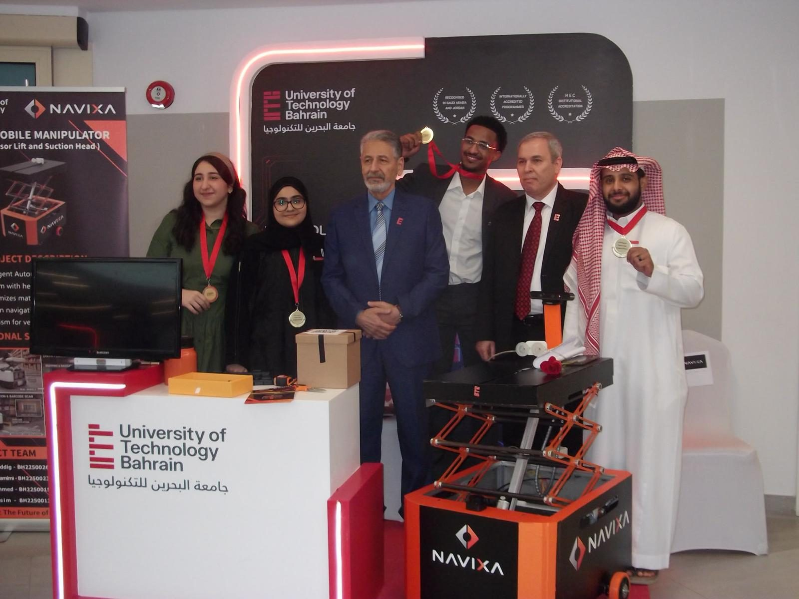</a>
<p align="center"><sub>Navixa at the UTB Projects Expo, 2026</sub></p>
<a href="docs/media/poster-robot.jpg">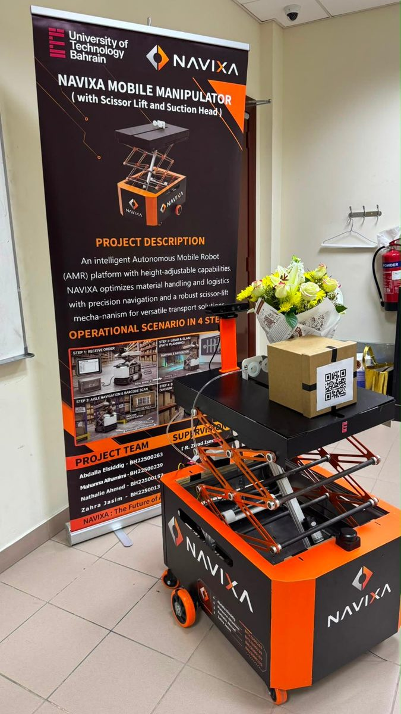</a>
<a href="docs/media/lift-test.jpg">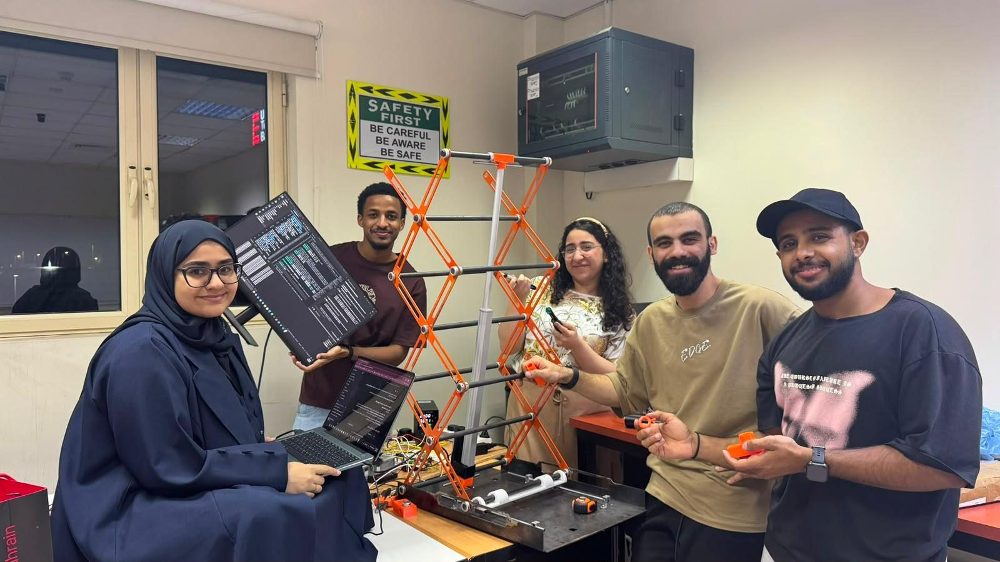</a>
</td>
</tr>
</table>

<picture>
  <source media="(prefers-color-scheme: dark)" srcset="docs/assets/divider-dark.svg">
  
</picture>

<!-- ═══════════════════════════════════════════════════════════════════════ -->
<!--                                 MISSION                                 -->
<!-- ═══════════════════════════════════════════════════════════════════════ -->

<picture>
  <source media="(prefers-color-scheme: dark)" srcset="docs/assets/eyebrow-mission-dark.svg">
  
</picture>

## 🧭 The mission

One dashboard click publishes `/mission/start`. The **coordinator** node (`amr_coordinator`) then runs a linear state machine with wait-points: every low-level action is a string on `/aux/command`, every completion is an `EVT …` event on `/aux/status`, and vision is a request/reply pair on `/vision/request` → `/vision/result`.

<picture>
  <source media="(prefers-color-scheme: dark)" srcset="docs/assets/mission-dark.svg">
  
</picture>

<table>
<tr>
<td width="50%" valign="top">

**Hardware contract** (`/aux/command` → Teensy → `/aux/status`)

| Command | Teensy action | Completion event |
|---|---|---|
| `LIFT <mm>` | Move scissor lift to height | `EVT LIFT DONE` |
| `PICK` / `DROP` | Lift to bench-calibrated pick / drop height | `EVT LIFT DONE` |
| `STEP EXT` / `STEP RET` | Extend / retract the suction carriage | `EVT STEP DONE` |
| `PUMP ON` / `PUMP OFF` | Vacuum pump + valve | `EVT PUMP ON` / `EVT PUMP OFF` |
| `STOP` | Halt everything | — |
| — | Any fault | `EVT FAULT <what>` → mission abort |

</td>
<td width="50%" valign="top">

**Vision contract** (`/vision/request` → `/vision/result`)

| Request | What vision does | Reply |
|---|---|---|
| `SHELF_QR` | Read the shelf's QR label | `OK <id>` / `FAIL` |
| `BOX_QR` | Read the box QR **and** centre the suction cup on it by rotating the robot | `OK <sku>` / `FAIL` |

**Dashboard states** (`amr/status`)

`IDLE` → `NAVIGATING` → `SCANNING QR` → `DETECTING BOX` → `ALIGNING` → `LIFTING` → `DELIVERING` → `IDLE`

</td>
</tr>
</table>

<picture>
  <source media="(prefers-color-scheme: dark)" srcset="docs/assets/divider-dark.svg">
  
</picture>

<!-- ═══════════════════════════════════════════════════════════════════════ -->
<!--                              ARCHITECTURE                               -->
<!-- ═══════════════════════════════════════════════════════════════════════ -->

<picture>
  <source media="(prefers-color-scheme: dark)" srcset="docs/assets/eyebrow-architecture-dark.svg">
  
</picture>

## 🏗️ System architecture

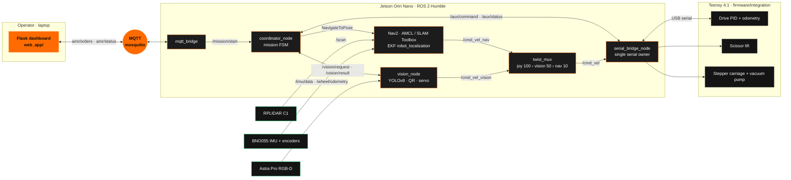
```mermaid
flowchart LR
    classDef web fill:#FF6B00,stroke:#FF6B00,color:#0a0a0a,font-weight:bold
    classDef ros fill:#1c1c1c,stroke:#FF6B00,color:#ffffff
    classDef hw fill:#141414,stroke:#6b6b6b,color:#ffffff
    classDef sensor fill:#141414,stroke:#00CC66,color:#ffffff

    subgraph OPERATOR["Operator · laptop"]
        DASH["Flask dashboard<br/>web_app/"]:::web
    end
    BROKER(("MQTT<br/>mosquitto")):::web

    subgraph JETSON["Jetson Orin Nano · ROS 2 Humble"]
        BRIDGE["mqtt_bridge"]:::ros
        COORD["coordinator_node<br/>mission FSM"]:::ros
        VISION["vision_node<br/>YOLOv8 · QR · servo"]:::ros
        NAV["Nav2 · AMCL / SLAM Toolbox<br/>EKF robot_localization"]:::ros
        MUX["twist_mux<br/>joy 100 › vision 50 › nav 10"]:::ros
        SERIAL["serial_bridge_node<br/>single serial owner"]:::ros
    end

    subgraph TEENSY["Teensy 4.1 · firmware/integration"]
        DRIVE["Drive PID + odometry"]:::hw
        LIFT["Scissor lift"]:::hw
        GRIP["Stepper carriage + vacuum pump"]:::hw
    end

    LIDAR["RPLIDAR C1"]:::sensor
    CAM["Astra Pro RGB-D"]:::sensor
    IMU["BNO055 IMU + encoders"]:::sensor

    DASH <-->|"amr/orders · amr/status"| BROKER <--> BRIDGE
    BRIDGE -->|"/mission/start"| COORD
    COORD <-->|"/vision/request · /vision/result"| VISION
    COORD -->|"NavigateToPose"| NAV
    COORD <-->|"/aux/command · /aux/status"| SERIAL
    NAV -->|"/cmd_vel_nav"| MUX
    VISION -->|"/cmd_vel_vision"| MUX
    MUX -->|"/cmd_vel"| SERIAL
    SERIAL <-->|"USB serial"| DRIVE
    SERIAL --> LIFT
    SERIAL --> GRIP
    LIDAR -->|"/scan"| NAV
    IMU -->|"/imu/data · /wheel/odometry"| NAV
    CAM --> VISION
```

| Node | Role |
|---|---|
| `coordinator_node` | The mission brain. A plain async FSM that sequences Nav2, vision, lift, stepper and pump for one pick-and-place cycle. |
| `vision_node` | Answers `SHELF_QR` / `BOX_QR` and centres the cup by publishing to `/cmd_vel_vision`. |
| `mqtt_bridge` | Translates dashboard orders into `/mission/start` and streams robot state back as `amr/status`, with a 3 s heartbeat. |
| `serial_bridge_node` | The **only** process that opens `/dev/ttyACM0`. Turns `/cmd_vel` into wheel RPM, forwards `/aux/command` verbatim, republishes `EVT …` lines on `/aux/status`, publishes odometry and IMU. |
| EKF (`robot_localization`) | Fuses wheel odometry + IMU into a smooth `odom → base_footprint`. |
| SLAM Toolbox / AMCL + Nav2 | Builds and uses the warehouse map, localises, plans and drives. |
| `twist_mux` | Arbitrates the wheel bus: joystick (100) › vision (50) › Nav2 (10). |

> **Design rule:** only one program may own the robot's single USB serial line. The coordinator never opens the port; it speaks plain strings to `serial_bridge_node`, which makes the blocking wait-for-completion logic trivial to read and debug.

<picture>
  <source media="(prefers-color-scheme: dark)" srcset="docs/assets/divider-dark.svg">
  
</picture>

<!-- ═══════════════════════════════════════════════════════════════════════ -->
<!--                                HARDWARE                                 -->
<!-- ═══════════════════════════════════════════════════════════════════════ -->

<picture>
  <source media="(prefers-color-scheme: dark)" srcset="docs/assets/eyebrow-hardware-dark.svg">
  
</picture>

## 🔩 Hardware

<table>
<tr>
<td width="62%" valign="top">

| Subsystem | Component | Details |
|---|---|---|
| **Compute** | NVIDIA Jetson Orin Nano 8 GB | Ubuntu 22.04 · ROS 2 Humble · 40 TOPS · runs the full autonomy stack |
| **MCU** | Teensy 4.1 (ARM Cortex-M7) | PlatformIO · one unified firmware for drive, lift, stepper and pump · USB serial at 20 Hz telemetry |
| **Drive** | 2 × AMX 775 planetary DC motors | 24 V · 1:51 · BTS7960 H-bridge per motor · quadrature encoders · PID velocity loop |
| **Chassis** | Aluminium extrusion frame | Ø 125 mm wheels · 0.65 m wheel base · differential drive |
| **LiDAR** | Slamtec RPLIDAR C1 | 360° · 12 m range · 8000 samples/s → `/scan` |
| **Camera** | Orbbec Astra Pro | RGB + IR depth · 0.6–8 m → QR reading and box detection |
| **IMU** | Bosch BNO055 | On the Teensy's Wire1 bus → `/imu/data`, fused by EKF |
| **Lift** | Linear-actuator scissor lift | 434 mm actuator stroke · 1.32 m platform height at full extension · bottom limit switch for homing |
| **Gripper** | Stepper carriage + vacuum pump | TB6600-driven carriage with home/max limit switches · relay-switched pump and vent valve · suction cup |
| **Power** | 2 × 6S Li-ion packs | **6S-3P** drive rail and **6S-2P** electronics rail, isolated so motor spikes never brown out the Jetson or the camera |

</td>
<td width="38%" valign="top">
<a href="docs/media/frame-assembly.jpg">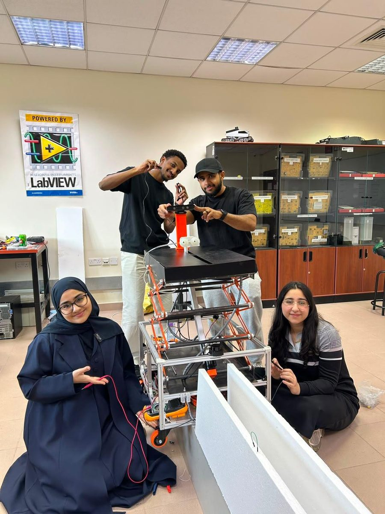</a>
<p align="center"><sub>Frame assembly with the drive base and first wiring</sub></p>
</td>
</tr>
</table>

<picture>
  <source media="(prefers-color-scheme: dark)" srcset="docs/assets/divider-dark.svg">
  
</picture>

<!-- ═══════════════════════════════════════════════════════════════════════ -->
<!--                                SOFTWARE                                 -->
<!-- ═══════════════════════════════════════════════════════════════════════ -->

<picture>
  <source media="(prefers-color-scheme: dark)" srcset="docs/assets/eyebrow-software-dark.svg">
  
</picture>

## 🧩 Software stack

### ROS 2 workspace · `ros2_ws/src`

| Package | What it contains |
|---|---|
| [`amr_bringup`](ros2_ws/src/amr_bringup) | Top-level launch files: `bringup.launch.py`, `robot_navigation.launch.py`, `robot_slam.launch.py` — the single entry points to start the robot. |
| [`amr_coordinator`](ros2_ws/src/amr_coordinator) | Mission coordinator FSM (`coordinator_node.py`) and a camera-free `vision_stub` that satisfies the same contract for dry runs. |
| [`amr_navigation`](ros2_ws/src/amr_navigation) | Nav2 params, SLAM Toolbox config, EKF, laser filter, `twist_mux`, the surveyed `warehouse_map`, named `waypoints.yaml` and the waypoint saver / navigator / mission-runner scripts. |
| [`amr_vision`](ros2_ws/src/amr_vision) | `vision_node`, YOLOv8 box / QR / barcode detectors, multi-strategy QR decoding, depth utilities, visual-servo centring, the `mqtt_bridge` and test / dataset scripts. |
| [`amr_hardware`](ros2_ws/src/amr_hardware) | `serial_bridge_node` — the single owner of the Teensy serial port. |
| [`amr_description`](ros2_ws/src/amr_description) | URDF / Xacro robot model, Gazebo control plugin, RViz2 display launch and a headless simulation launch. |
| `sllidar_ros2` | Slamtec's RPLIDAR driver (vendored). |

### Firmware · `firmware/integration`

One image for the Teensy 4.1 that merges three bench-proven test projects into a single serial protocol: drive PID + encoder odometry + IMU (`DriveSystem`, `MotorController`, `PIDController`), the scissor lift (`LiftControl`) and the suction carriage + pump (`StepperControl`, `PumpControl`). Pin map, calibration constants and the wire protocol live in [`Config.h`](firmware/integration/src/Config.h) and the project [README](firmware/integration/README.md).

### Web dashboard · `web_app/`

A Flask app that serves the brand landing page and a password-protected operator dashboard, bridged to the robot through `paho-mqtt`. It is also deployed at **[navixaa.vercel.app](https://navixaa.vercel.app)** (MQTT disabled in cloud mode, so the robot shows offline there).

<table>
<tr>
<td width="50%" valign="top">

**Robot → web** · `amr/status`

```json
{
  "state": "NAVIGATING",
  "vision_stage": "SCANNING QR",
  "current_order": "SHELF_A07",
  "battery": 78.5
}
```

</td>
<td width="50%" valign="top">

**Web → robot** · `amr/orders`

```json
{ "command": "PICK", "shelf_id": "SHELF_A07", "order_id": "a3f9b2c1" }
{ "command": "STOP" }
```

`STOP` is published with **QoS 2** (exactly once); orders and status use QoS 1.

</td>
</tr>
</table>

<picture>
  <source media="(prefers-color-scheme: dark)" srcset="docs/assets/divider-dark.svg">
  
</picture>

<!-- ═══════════════════════════════════════════════════════════════════════ -->
<!--                                 VISION                                  -->
<!-- ═══════════════════════════════════════════════════════════════════════ -->

<picture>
  <source media="(prefers-color-scheme: dark)" srcset="docs/assets/eyebrow-vision-dark.svg">
  
</picture>

## 👁️ Vision pipeline

Vision is a **service, not a driver**: the coordinator asks two questions and gets an answer. A custom-trained YOLOv8 model localises the box, QR and barcode regions first, so decoding runs on a small, enhanced crop instead of the whole frame; the result only counts once the same value is read on several consecutive frames.

<picture>
  <source media="(prefers-color-scheme: dark)" srcset="docs/assets/vision-dark.svg">
  
</picture>

- **Why YOLO-then-decode:** decoding a full 640×480 frame is slow and unreliable on small or angled codes. Localising first makes it fast and robust to angle and lighting.
- **Why the whole robot rotates:** a differential-drive robot cannot strafe and the cup has no servo. The horizontal pixel offset of the box drives a clamped, EMA-smoothed proportional rotation on `/cmd_vel_vision`, which `twist_mux` prioritises over Nav2.
- **Why it keeps working without depth:** with `DEPTH_ENABLED=0` the node runs RGB-only. The mission never uses vision depth, so a power-hungry depth stream dropping over USB cannot stop a pick.

<picture>
  <source media="(prefers-color-scheme: dark)" srcset="docs/assets/divider-dark.svg">
  
</picture>

<!-- ═══════════════════════════════════════════════════════════════════════ -->
<!--                               QUICK START                               -->
<!-- ═══════════════════════════════════════════════════════════════════════ -->

<picture>
  <source media="(prefers-color-scheme: dark)" srcset="docs/assets/eyebrow-quickstart-dark.svg">
  
</picture>

## 🚀 Quick start

> Every ROS 2 terminal must `source install/setup.bash` and use a **matching** `ROS_DOMAIN_ID` on the Jetson and the laptop (the team uses `export ROS_DOMAIN_ID=30`). The full, verified startup order is in [`docs/RUN_full_scenario.md`](docs/RUN_full_scenario.md).

<details open>
<summary><b>1 · Install &amp; build</b> (Jetson or laptop, Ubuntu 22.04)</summary>

```bash
# ROS 2 Humble + Nav2 + SLAM Toolbox + Gazebo Classic
sudo apt install ros-humble-desktop ros-humble-gazebo-ros-pkgs \
     ros-humble-nav2-bringup ros-humble-slam-toolbox \
     ros-humble-robot-localization ros-humble-xacro \
     ros-humble-joint-state-publisher-gui ros-humble-twist-mux mosquitto

git clone https://github.com/AMR-Warehouse-Team/AMR-Warehouse-System.git
cd AMR-Warehouse-System/ros2_ws
colcon build --symlink-install
source install/setup.bash
```

</details>

<details>
<summary><b>2 · Bring up hardware + navigation</b> (Jetson)</summary>

```bash
sudo systemctl start mosquitto                      # MQTT broker; note the Jetson IP with `hostname -I`
ros2 launch amr_bringup robot_navigation.launch.py  # TF · serial_bridge · EKF · LiDAR · AMCL · Nav2 · twist_mux

# sanity checks
ros2 topic echo /wheel/odometry --once
ros2 topic echo /imu/data --once
ros2 topic list | grep -E "scan|aux|cmd_vel"
```

Then localise the robot on the map from a machine with a display: `ros2 launch amr_bringup robot_navigation.launch.py launch_rviz:=true`, use **2D Pose Estimate** and wait for the AMCL cloud to converge. Nav2 drives to nonsense if AMCL is not localised.

</details>

<details>
<summary><b>3 · Vision, dashboard bridge and web app</b></summary>

```bash
# Jetson
export DEPTH_ENABLED=0
ros2 run amr_vision vision_node          # "Ready — waiting on /vision/request (SHELF_QR | BOX_QR)"
ros2 run amr_vision mqtt_bridge

# laptop
cd web_app && pip install flask paho-mqtt
MQTT_BROKER=<jetson-ip> python3 app.py   # http://localhost:5000 → "Robot Online"
```

</details>

<details>
<summary><b>4 · Run a mission</b></summary>

```bash
ros2 run amr_coordinator coordinator_node --ros-args \
  -p shelf_a:="[1.85, 0.42, 0.0]" \
  -p dropoff:="[0.10, 2.30, 90.0]" \
  -p home:="[0.0, 0.0, 0.0]"

# trigger from the dashboard (PICK) or by hand:
ros2 topic pub --once /mission/start std_msgs/msg/Empty "{}"
```

Replace the poses with the surveyed values for your map: the defaults are placeholders. Named locations can also be saved and replayed with the waypoint tools in `amr_navigation`.

</details>

<details>
<summary><b>Simulation &amp; model only</b> (no robot)</summary>

```bash
ros2 launch amr_description display.launch.py      # URDF in RViz2
ros2 launch amr_description launch_sim.launch.py   # headless Gazebo
ros2 run amr_coordinator vision_stub               # answers SHELF_QR / BOX_QR without a camera
```

</details>

<picture>
  <source media="(prefers-color-scheme: dark)" srcset="docs/assets/divider-dark.svg">
  
</picture>

<!-- ═══════════════════════════════════════════════════════════════════════ -->
<!--                                  DOCS                                   -->
<!-- ═══════════════════════════════════════════════════════════════════════ -->

<picture>
  <source media="(prefers-color-scheme: dark)" srcset="docs/assets/eyebrow-docs-dark.svg">
  
</picture>

## 🧪 Testing & documentation

**Start here on test day:** [`docs/TESTING_COMMANDS.md`](docs/TESTING_COMMANDS.md), a per-subsystem command reference for testing each part of the stack on its own and then end-to-end.

| Document | What it covers |
|---|---|
| [`docs/TESTING_COMMANDS.md`](docs/TESTING_COMMANDS.md) | Vision, aux hardware, drive / odometry / IMU, LiDAR, Nav2 + RViz, SLAM, MQTT and the coordinator mission, one subsystem at a time |
| [`docs/RUN_full_scenario.md`](docs/RUN_full_scenario.md) | Test-day run narrative, system audit and bottom-up startup order |
| [`docs/TEST_RUNBOOK_vision.md`](docs/TEST_RUNBOOK_vision.md) | Vision node deep-dive and troubleshooting |
| [`docs/MQTT_GUIDE.md`](docs/MQTT_GUIDE.md) | MQTT broker and dashboard from scratch |
| [`docs/slam_mapping.md`](docs/slam_mapping.md) | Building the warehouse map with SLAM Toolbox |
| [`docs/waypoint_navigation_guide.md`](docs/waypoint_navigation_guide.md) | Saving and navigating named waypoints |
| [`docs/HANDOFF_zahra_firmware.md`](docs/HANDOFF_zahra_firmware.md) | Firmware port spec: wire protocol, pin re-map, starter code |
| [`docs/HANDOFF_abdalla_vision.md`](docs/HANDOFF_abdalla_vision.md) | Vision hand-off: contract, centring behaviour, test plan |
| [`docs/setup-notes/ros2-laptop-install.md`](docs/setup-notes/ros2-laptop-install.md) | Setting up a development laptop |
| [`web_app/README.md`](web_app/README.md) · [`firmware/integration/README.md`](firmware/integration/README.md) | Dashboard deployment and the unified Teensy firmware |

<details>
<summary><b>Repository layout</b></summary>

```
AMR-Warehouse-System/
├── ros2_ws/src/
│   ├── amr_bringup/        # launch entry points (bringup · navigation · slam)
│   ├── amr_coordinator/    # mission FSM + vision_stub
│   ├── amr_navigation/     # Nav2 · SLAM Toolbox · EKF · twist_mux · map · waypoints
│   ├── amr_vision/         # vision_node · YOLOv8 detectors · QR decoding · mqtt_bridge
│   ├── amr_hardware/       # serial_bridge_node (single serial owner)
│   ├── amr_description/    # URDF/Xacro · Gazebo · RViz2
│   └── sllidar_ros2/       # RPLIDAR driver
├── firmware/
│   ├── integration/        # the Teensy 4.1 image: drive + lift + stepper + pump
│   └── src/                # original drive-only firmware (kept for reference)
├── web_app/                # Flask landing page + operator dashboard + MQTT bridge
└── docs/                   # guides, hand-offs, test runbooks, media and README assets
```

</details>

<picture>
  <source media="(prefers-color-scheme: dark)" srcset="docs/assets/divider-dark.svg">
  
</picture>

<!-- ═══════════════════════════════════════════════════════════════════════ -->
<!--                               BUILD LOG                                 -->
<!-- ═══════════════════════════════════════════════════════════════════════ -->

<picture>
  <source media="(prefers-color-scheme: dark)" srcset="docs/assets/eyebrow-build-dark.svg">
  
</picture>

## 🛠️ Behind the build

Ten weeks of fabrication, wiring and integration.

<table>
<tr>
<td width="25%" align="center"><a href="web_app/static/images/work-01.jpg">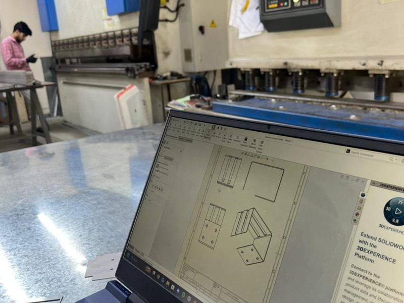</a><br><sub><b>01</b> · Design &amp; fabrication</sub></td>
<td width="25%" align="center"><a href="web_app/static/images/work-02.jpg">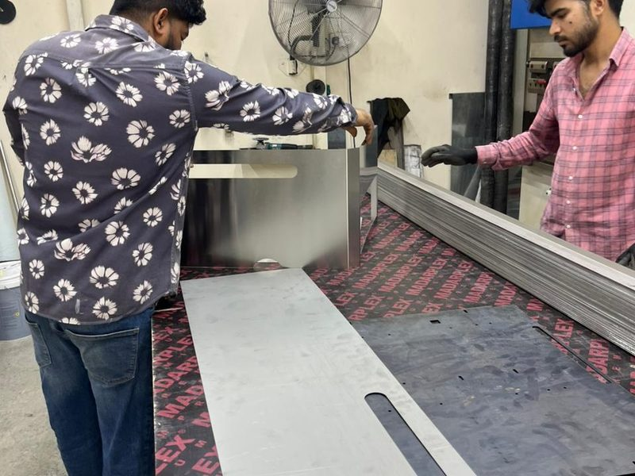</a><br><sub><b>02</b> · Chassis assembly</sub></td>
<td width="25%" align="center"><a href="web_app/static/images/work-03.jpg">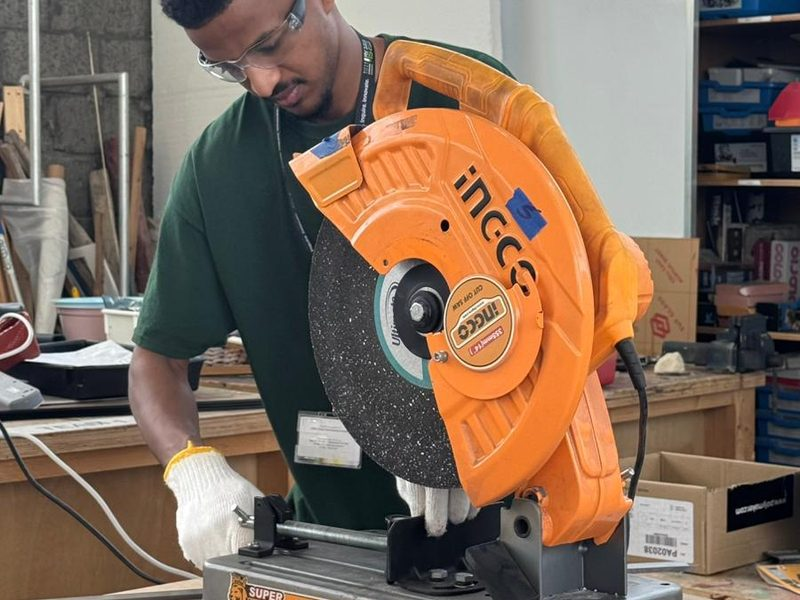</a><br><sub><b>03</b> · Electronics wiring</sub></td>
<td width="25%" align="center"><a href="web_app/static/images/work-04.jpg">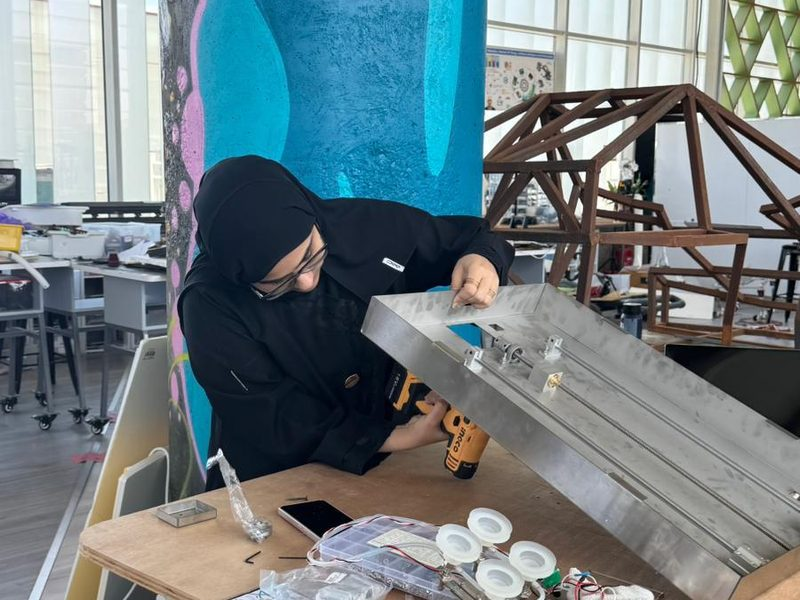</a><br><sub><b>04</b> · LiDAR mounting</sub></td>
</tr>
<tr>
<td width="25%" align="center"><a href="web_app/static/images/work-05.jpg">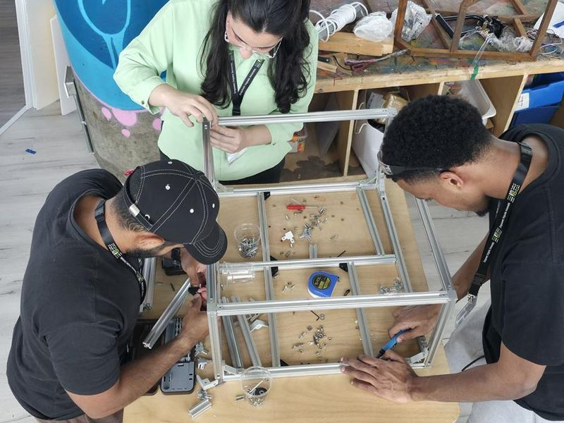</a><br><sub><b>05</b> · Vision system</sub></td>
<td width="25%" align="center"><a href="web_app/static/images/work-06.jpg">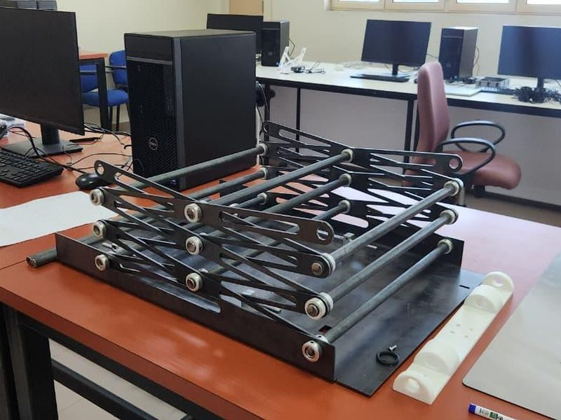</a><br><sub><b>06</b> · Navigation testing</sub></td>
<td width="25%" align="center"><a href="web_app/static/images/work-07.jpg">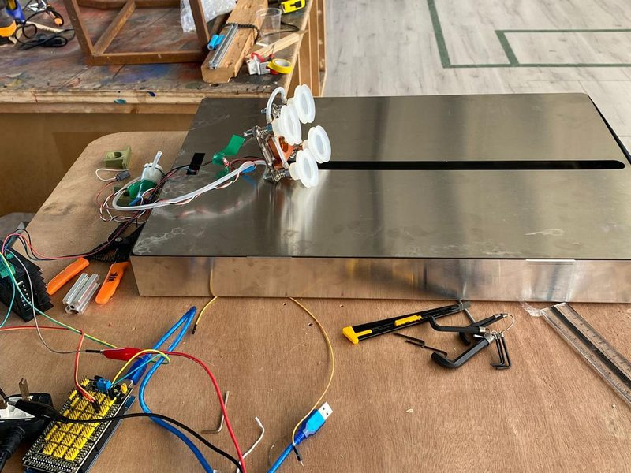</a><br><sub><b>07</b> · Full integration</sub></td>
<td width="25%" align="center"><a href="docs/media/expo-medals.jpg">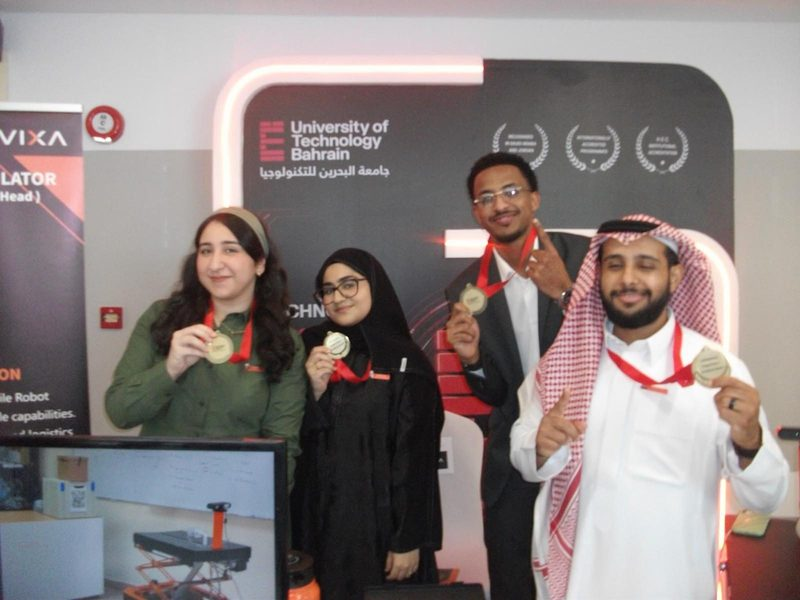</a><br><sub><b>08</b> · Expo day</sub></td>
</tr>
</table>

<details>
<summary><b>More photos</b></summary>
<br>
<table>
<tr>
<td width="20%" align="center"><a href="docs/media/early-build.jpg">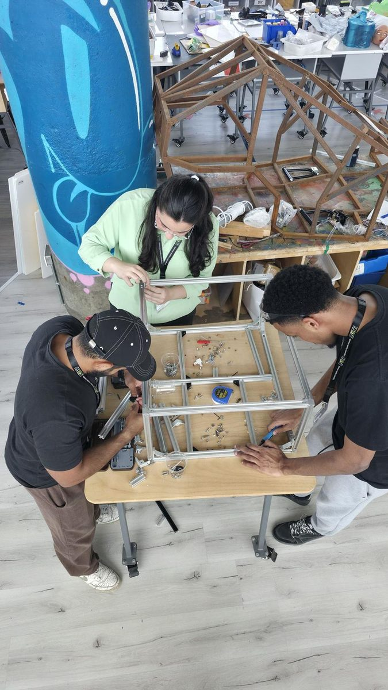</a><br><sub>Early build</sub></td>
<td width="20%" align="center"><a href="docs/media/cutting.jpg">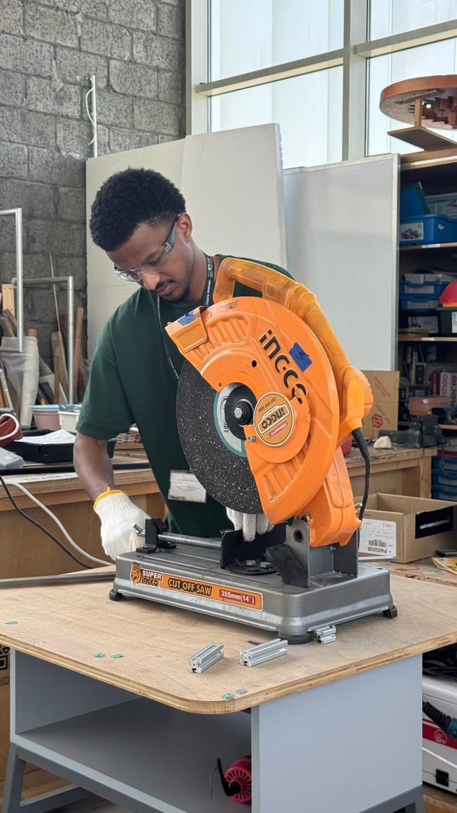</a><br><sub>Cutting extrusion</sub></td>
<td width="20%" align="center"><a href="docs/media/wiring.jpg">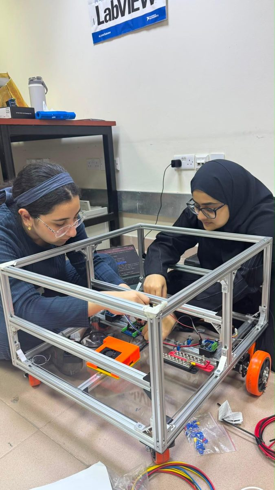</a><br><sub>Wiring the frame</sub></td>
<td width="20%" align="center"><a href="docs/media/brochure.jpg">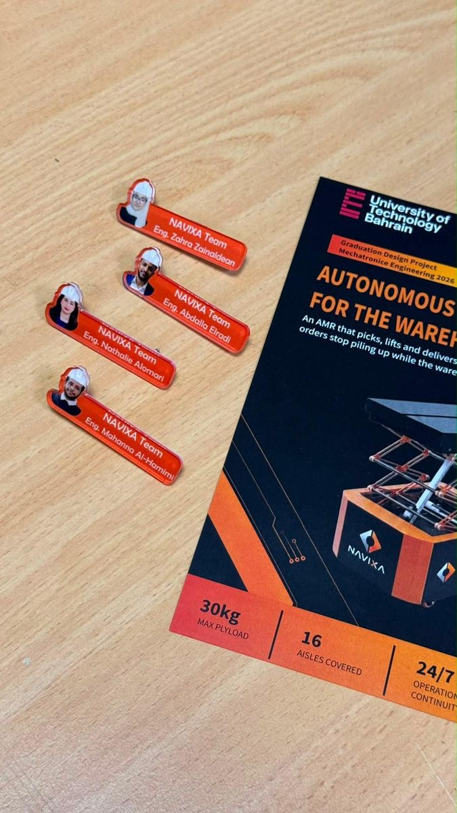</a><br><sub>Brochure &amp; badges</sub></td>
<td width="20%" align="center"><a href="docs/media/celebration.jpg">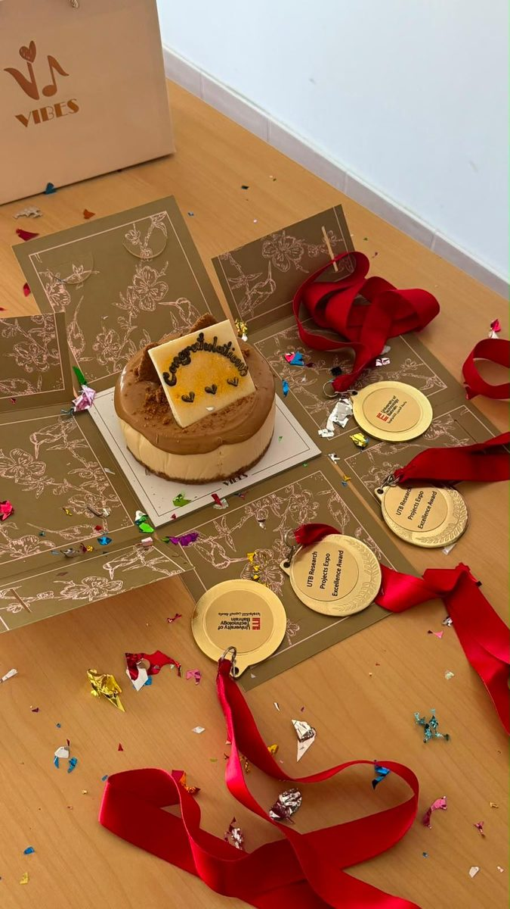</a><br><sub>Celebration</sub></td>
</tr>
</table>
</details>

<picture>
  <source media="(prefers-color-scheme: dark)" srcset="docs/assets/divider-dark.svg">
  
</picture>

<!-- ═══════════════════════════════════════════════════════════════════════ -->
<!--                                  TEAM                                   -->
<!-- ═══════════════════════════════════════════════════════════════════════ -->

<picture>
  <source media="(prefers-color-scheme: dark)" srcset="docs/assets/eyebrow-team-dark.svg">
  
</picture>

## 👥 The team

Four disciplines. One robot. University of Technology Bahrain, class of 2026.

<table>
<tr>
<td width="25%" align="center" valign="top">
<picture>
  <source media="(prefers-color-scheme: dark)" srcset="docs/assets/team-nathalie-dark.svg">
  
</picture>
<p>
<a href="https://www.linkedin.com/in/nathalie-alomari"></a>
<a href="https://github.com/NathalieAlomari-ai"></a>
</p>
</td>
<td width="25%" align="center" valign="top">
<picture>
  <source media="(prefers-color-scheme: dark)" srcset="docs/assets/team-abdalla-dark.svg">
  
</picture>
<p>
<a href="https://www.linkedin.com/in/abdalla-elradi"></a>
<a href="https://github.com/a-elradi"></a>
<a href="https://aelradi.engineer"></a>
</p>
</td>
<td width="25%" align="center" valign="top">
<picture>
  <source media="(prefers-color-scheme: dark)" srcset="docs/assets/team-mahanna-dark.svg">
  
</picture>
<p>
<a href="https://www.linkedin.com/in/mahanna-al-hamimi"></a>
<a href="https://github.com/MahannaAlHamimi"></a>
</p>
</td>
<td width="25%" align="center" valign="top">
<picture>
  <source media="(prefers-color-scheme: dark)" srcset="docs/assets/team-zahra-dark.svg">
  
</picture>
<p>
<a href="https://www.linkedin.com/in/zahra-jasim"></a>
<a href="https://github.com/nunzahkii"></a>
</p>
</td>
</tr>
</table>

<div align="center">

<picture>
  <source media="(prefers-color-scheme: dark)" srcset="docs/assets/footer-dark.svg">
  
</picture>

<p>
<a href="https://navixaa.vercel.app"></a>
<a href="https://github.com/AMR-Warehouse-Team/AMR-Warehouse-System/issues"></a>
<a href="#top"></a>
</p>

<sub>© 2026 Navixa · University of Technology Bahrain · Graduation design project · README graphics generated by <a href="docs/assets/build_assets.py">docs/assets/build_assets.py</a></sub>

</div>
